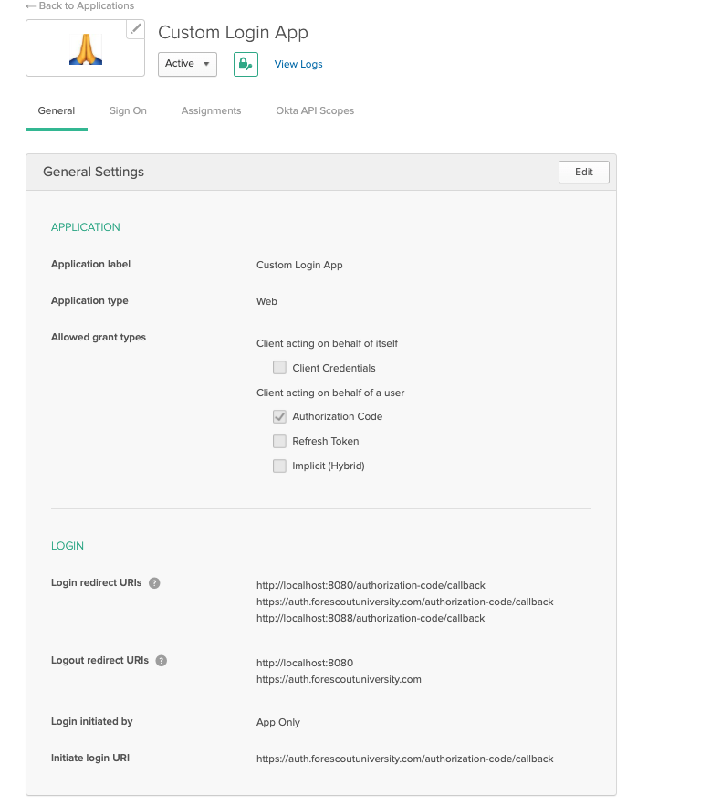
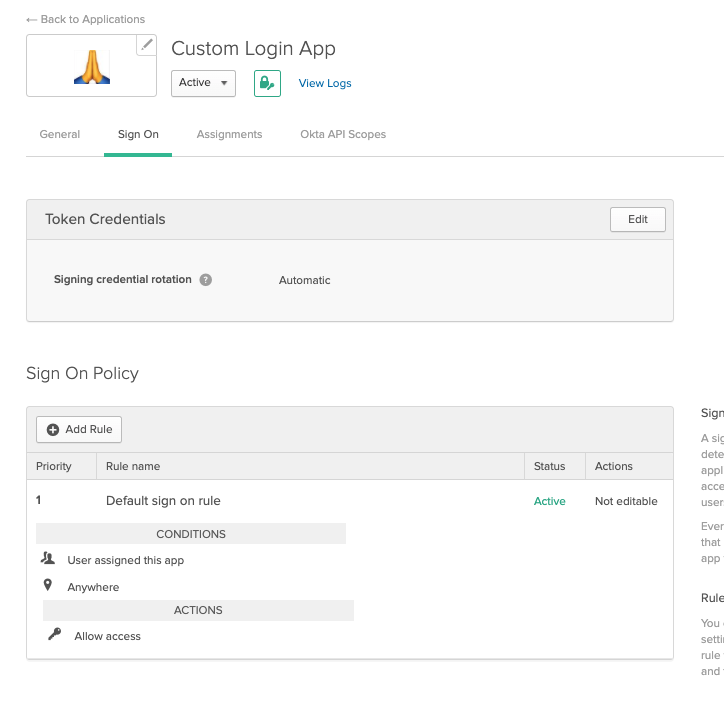
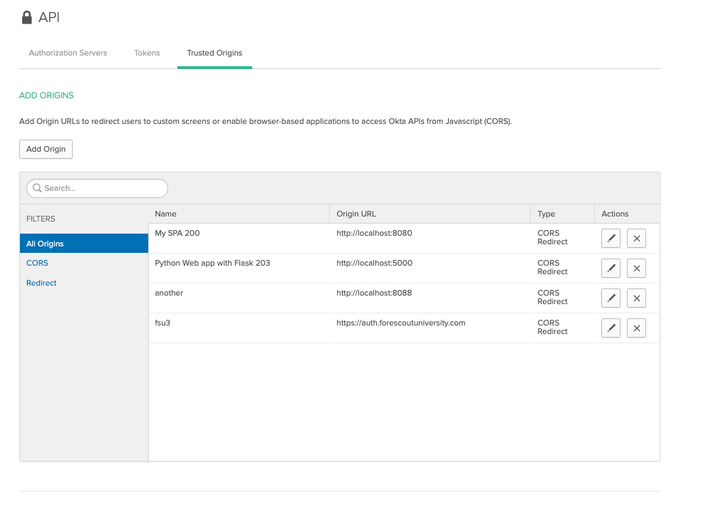
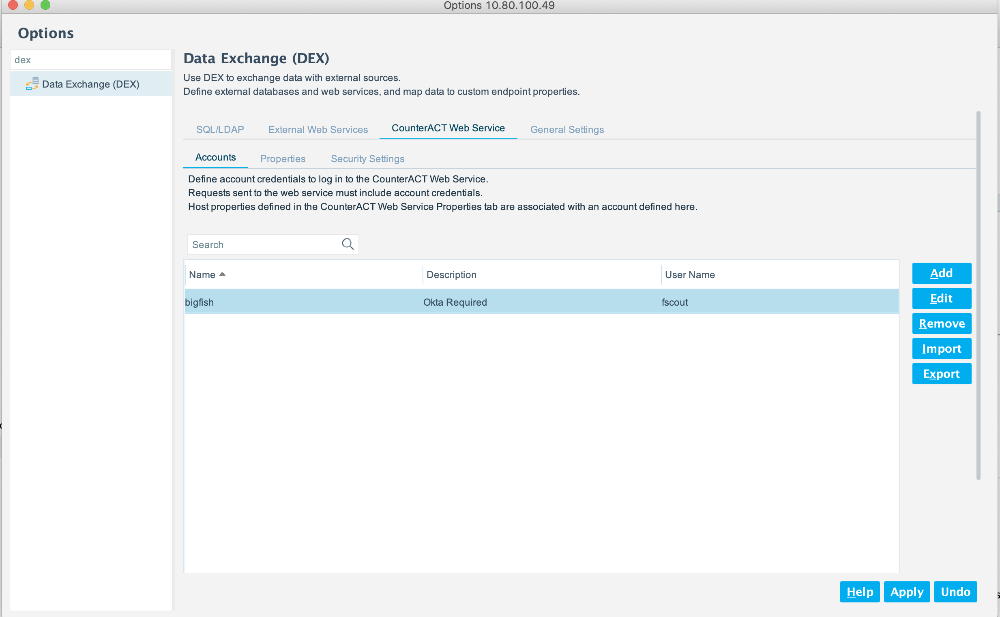
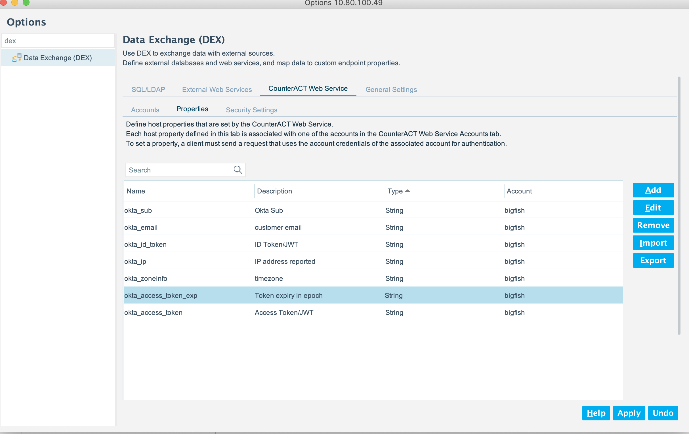

# Sample OKTA Auth for eyeSight Endpoint

The Use case for this App is to authenticate the user with OKTA via a web page, capture relevant information from OKTA and the local context, and send to eyesight via DEX.

This example shows you how to use the OIDC Middleware Library to login a user.  The login is achieved with the Okta Sign In Widget, which gives you more control to customize the login experience within your app.  After the user authenticates, they are redirected back to the application and a local cookie session is created using express-session.

The node.js server in our testing can be run locally or behind an NGINX reverse proxy and was deployed with pm2.  The IP address of the endpoint that is sent the the eyesight is always from the perspective of the location of the server.  That is, if the server is deployed on the internet, the IP address will be the public IP address if the device is behind a NAT device.  If the node.js server is deployed in a private network, the ip address sent will be a private address.

The eyesight in our example resides behind an NGINX reverse proxy and all calls are made over the standard https port.

## Configuration

[config.js](config.js) uses environment variables which can be either exported in the shell or stored in a file named `testenv` in this directory. See [dotenv](https://www.npmjs.com/package/dotenv) for more details on this file format. It will look something like:

```

# Web app
ISSUER=https://dev-171713.okta.com/oauth2/default
CLIENT_ID=0oafdwapyUeoJ6dvU4x6
CLIENT_SECRET=mCyd0dfdfdfdfdfdfdfdfdfdfyJ

```

## Prerequisites

Before running this sample, you will need the following:

* An Okta Developer Account, you can sign up for one at https://developer.okta.com/signup/.
* An Okta Application, configured for Web mode. This is done from the Okta Developer Console and you can find instructions [here](https://developer.okta.com/authentication-guide/implementing-authentication/auth-code#1-setting-up-your-application).  When following the wizard, use the default properties.  They are designed to work with our sample applications.
* Your Okta Application entry needs the logout callback.  The "Logout redirect URIs" under "General" for the application should list `http://localhost:8088` as shown below.  If it is not present, click "Edit" and add it.


--

## OKTA App configuration







## Forescout configuration

The `forescout.js` file has the relevant credentials for access to the DEX web service.

```
const CTIP = 'eyesight.example.com' // Forescout Appliance IP
const CTuserName = 'fscout@bigfish' // service username  - needs the @
const CTpassWord = 'yourpassword'      // service password
```

### DEX Configuration

A "CounterACT Web Service" needs to be created to all for the node.js server to send the properties.



And the following properties created:



Note, we can send any properties that OKTA generates, so this is just an example of what is possible.


## Running This Example

install dependencies:

```bash
npm install
```

With variables set, start the app server:

```
npm run login-server
```

Now navigate to http://localhost:8080 in your browser.

--


## Deployment

### Auth Server NGINX Config
This is the node.js server contained in this distribution.

```
server {
        listen  443 ssl;
        server_name     auth.example.com;
        ssl_certificate /etc/ssl/certs/fsuwild2018.crt;
        ssl_certificate_key /etc/ssl/certs/fsuwild2018.key;
        #client_max_body_size 1000m;
        location / {
        proxy_pass http://localhost:8088;
        proxy_buffering off;
        proxy_http_version 1.1;
      #proxy_set_header X-Forwarded-For $remote_addr;
        proxy_set_header X-Forwarded-For $proxy_add_x_forwarded_for;
        proxy_set_header Upgrade $http_upgrade;
        proxy_set_header Connection $http_connection;
        access_log off;
        }
}
```

Note   proxy_set_header X-Forwarded-For $proxy_add_x_forwarded_for; is important to get the real ip address of the client.  In our deployment it was front ended with Cloudflare, then the NGINX reverse proxy and the chain of IP addresses is forwarded and the client ip will be the first[0] entry.

### Deployed with `pm2`:

```
┌───────────────┬────┬───────┬────────┬────────┬─────┬────────┬───────────┐
│ Name          │ id │ mode  │ status │ ↺      │ cpu │ memory │
├───────────────┼────┼───────┼────────┼────────┼─────┼────────┼───────────┤
│ express-dev   │ 1  │ 1.0.0 │ fork   │ online │ 0   │ 0%     │ 33.8 MB   │
│ express-proxy │ 0  │ 1.0.0 │ fork   │ online │ 0   │ 0.1%   │ 45.3 MB   │
│ okta-auth     │ 3  │ 3.1.0 │ fork   │ online │ 1   │ 0.1%   │ 50.0 MB   │
└───────────────┴────┴───────┴────────┴────────┴─────┴────────┴───────────┘
 Use `pm2 show <id|name>` to get more details about an app
```

### eyeSight NGINX Config

This example is for the case when you want to place the eyeSight behind NGINX such if exposing to the internet.

```
server {
      #This is for Alexa App inbound access to CT
        listen  443 ssl;
        server_name     eyesight.example.com;
        ssl_certificate /etc/ssl/certs/fsu2018.crt;
        ssl_certificate_key /etc/ssl/certs/fsu2018.key;
        location / {
              proxy_pass https://10.80.100.49/;
            proxy_buffering off;
            proxy_http_version 1.1;
            proxy_set_header X-Forwarded-For $proxy_add_x_forwarded_for;
            proxy_set_header Upgrade $http_upgrade;
            proxy_set_header Connection $http_connection;
            access_log off;
        }
}
```


### References:

* [express-session]: [https://github.com/expressjs/session](https://github.com/expressjs/session)
* [OIDC Middleware Library]: [https://github.com/okta/okta-oidc-js/tree/master/packages/oidc-middleware](https://github.com/okta/okta-oidc-js/tree/master/packages/oidc-middleware)
* [Authorization Code Flow]: [https://developer.okta.com/authentication-guide/implementing-authentication/auth-code](https://developer.okta.com/authentication-guide/implementing-authentication/auth-code)
* [OIDC Web Application Setup Instructions]: [https://developer.okta.com/authentication-guide/implementing-authentication/auth-code#1-setting-up-your-application](https://developer.okta.com/authentication-guide/implementing-authentication/auth-code#1-setting-up-your-application)
* [Okta Sign In Widget]: [https://github.com/okta/okta-signin-widget](https://github.com/okta/okta-signin-widget)
* [Okta Sign In Widget - USEFUL]: [https://developer.aliyun.com/mirror/npm/package/@okta/okta-signin-widget](https://developer.aliyun.com/mirror/npm/package/@okta/okta-signin-widget)
